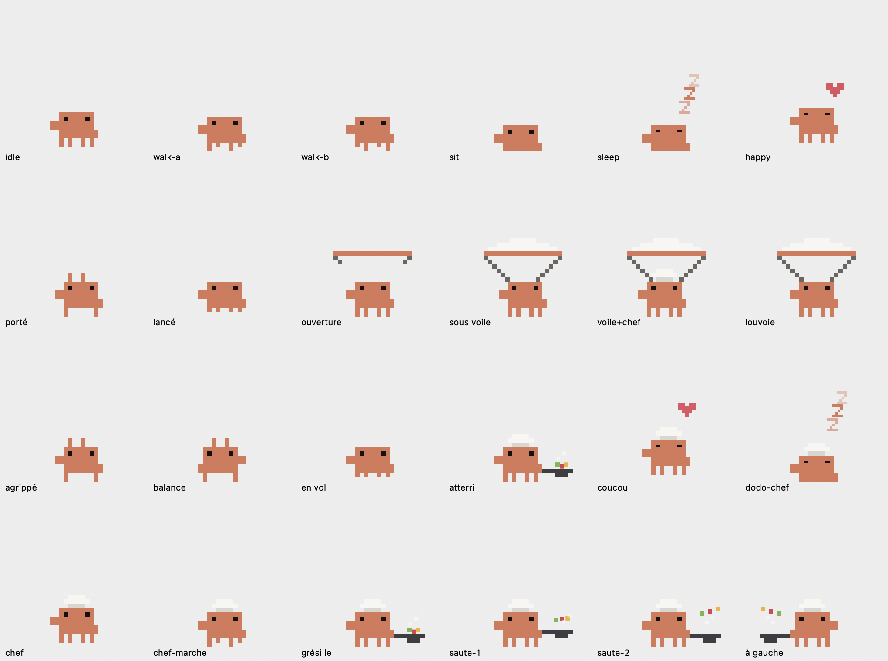

# Clawd Dock 🦀

A tiny pixel-art Clawd that lives on your macOS Dock and reacts to what Claude Code
is doing.

Desktop pets are not new. This one is different in one specific way: **it is not a
decoration, it is a status indicator with a personality.** Clawd knows when you sent
a message, when Claude is still thinking, when the answer landed, and when you closed
Claude entirely — and he acts it out. He climbs your Claude window, drops onto the
Dock, cooks while you wait, and serves the dish when it's done.

And it stays honest about resources: a native Swift/AppKit binary, **200 KB on disk,
~4 % CPU, zero dependencies, zero Electron**. One `build.sh`, no Xcode.

The 11 × 8 sprite was traced pixel by pixel from the original Clawd: body, ears,
four legs, two square eyes.



> **Unofficial fan project.** Not affiliated with, endorsed by, or sponsored by
> Anthropic. Clawd is Anthropic's mascot; the sprite here is a hand-made derivative
> of that character, shared for fun and non-commercial use only. The license below
> covers the code in this repository, not the character.

## Install

Download **`Clawd-Dock.dmg`** from the [latest release](../../releases/latest), open
it, drag `Clawd Dock.app` into `/Applications`. No build step, no source needed.

macOS will warn about an unidentified developer (the app is ad-hoc signed, not
notarized) — right-click → **Open** the first time, or run:

```bash
xattr -dr com.apple.quarantine "/Applications/Clawd Dock.app"
```

Or build it yourself:

```bash
git clone https://github.com/maximecll/clawd-dock.git
cd clawd-dock && ./build.sh && open "build/Clawd Dock.app"
```

It runs as an agent (`LSUIElement`): no Dock icon, just a 🐾 in the menu bar.
Right-click Clawd (or the paw) for the menu.

## His daily life

| Behaviour | Detail |
|---|---|
| Wanders | walks along the Dock's edge, turns around at both ends |
| Takes breaks | sits down, breathes, blinks |
| Falls asleep | after ~22 s of doing nothing, with floating `Zzz` |
| Reacts | click him for a little hop and a heart |
| Follows the cursor | optional, from the menu |

Clicks pass straight through his transparent pixels, so the Dock stays fully usable.

## Grab him and throw him 🪂

Grab him with the mouse: he dangles from your cursor by two legs. Carry him
anywhere, then **let go mid-swing** — he launches with the velocity of your gesture.

As soon as he starts falling and has enough height, the parachute opens: the canopy
unfurls from the rim upward, the lines go taut, and he drifts down at ~62 pt/s while
weaving — a curved diagonal, not a straight drop. He bounces off the screen edges
and settles gently back on the Dock.

Thrown too low or too gently, no canopy: he just falls and bounces. Put down without
momentum, he simply walks off.

The menu has **Toss him in the air 🪂** to launch him without the mouse.

## Wired into Claude Code

Three hooks write a keyword into `~/.clawd-dock/trigger`, which the app watches:

| Situation | Hook | What he does |
|---|---|---|
| You send a message | `UserPromptSubmit` → `prompt` | He rushes off to grab the top edge of your Claude window, swings, lets go, bounces onto the Dock, then puts on the chef hat and gets to work |
| Claude is answering | *(meanwhile)* | He stays at the stove, tossing peppers, tomato and corn in his pan |
| Claude is done | `Stop` → `done` | He serves the dish: a hop and a heart, then back to wandering |
| Session ended | `SessionEnd` → `session-end` | He settles down |
| Claude is open but idle | *(default)* | He just wanders and sits. He dozes off after 90 s of nothing |
| Claude is closed | *(detected on its own)* | He sleeps until you reopen Claude |

**The pan means one thing only: Claude is working.** He never starts cooking on his
own — if you see the frying pan, a request is in flight. If the `Stop` hook is ever
missed (crash, machine asleep), a watchdog clears the busy state after 15 minutes,
and closing Claude clears it immediately.

Claude's presence is checked through `NSWorkspace.runningApplications` (bundle
`com.anthropic.claude*`), not window geometry — a minimized or compact window won't
put him to sleep.

### Install the hooks

```bash
./install-hook.sh
```

⚠️ This edits your **`~/.claude/settings.json`**. It backs the file up to
`.bak-clawd` first and is safe to re-run (no duplicate entries). To remove: delete
the entries containing `.clawd-dock/trigger`, or restore the backup. Hooks are read
when a Claude Code session starts.

### Checking what he's reacting to

Every hook event and state change is appended to `~/.clawd-dock/log` (capped at
64 KB), which makes it easy to see whether a hook actually fired:

```bash
tail -f ~/.clawd-dock/log
```

### Trigger it by hand

```bash
echo prompt > ~/.clawd-dock/trigger   # climb, then cook
echo done   > ~/.clawd-dock/trigger   # serve the dish
echo toss   > ~/.clawd-dock/trigger   # launch him, parachute and all
```

## Start at login

System Settings → General → Login Items → add `Clawd Dock.app` to "Open at Login".

## Tuning

Everything lives at the top of [`Sources/PetView.swift`](Sources/PetView.swift), in
`enum Cfg`:

- `pixel` — size of one art pixel (5 pt ≈ the height of a Dock icon)
- `walkSpeed`, `stepsPerSecond` — pace and leg cadence
- `groundNudge` — how far he overlaps the Dock's edge
- `flipCycle` — how often the ingredients fly
- `fallGravity`, `bounciness` — free fall and bounces
- `chuteFall`, `chuteDrift`, `chuteCurve` — descent speed and shape of the curve
- `chuteMinHeight` — below this height the canopy won't open
- `busyTimeout` — how long before a missed `Stop` hook is written off
- `boredomDelay` — how long he stays awake with nothing happening

## Footprint

~4 % CPU, ~85 MB RAM, 200 KB on disk. It renders at 30 fps and throttles redraws
further while he is idle, sitting or asleep.

## How he finds the Dock

The app first looks for the Dock's window through `CGWindowListCopyWindowInfo`. On
recent macOS the Dock only exposes one full-screen window, so it falls back to the
strip reserved by `NSScreen.visibleFrame` — which gives the correct ledge when the
Dock is at the bottom. Hidden Dock, or Dock on the left/right: he walks along the
bottom of the screen instead.

## Development

`Tools/preview.swift` renders every pose off-screen into a PNG, so you can check the
artwork without taking a screenshot:

```bash
mkdir -p .pv && cp Tools/preview.swift .pv/main.swift
swiftc -swift-version 5 -framework AppKit -o .pv/preview .pv/main.swift Sources/PetView.swift
./.pv/preview sheet.png
```

Layout: [`Sources/PetView.swift`](Sources/PetView.swift) only draws (pixel art and
poses), [`Sources/main.swift`](Sources/main.swift) owns state, physics and screen
geometry. Source comments are in French.

## License

Apache License 2.0 — see [LICENSE](LICENSE) and [NOTICE](NOTICE).

Chosen over MIT on purpose: alongside the usual permissive terms it carries an
explicit trademark clause (section 6), which matters for a project built on someone
else's character. The license covers the code in this repository — not Clawd.
